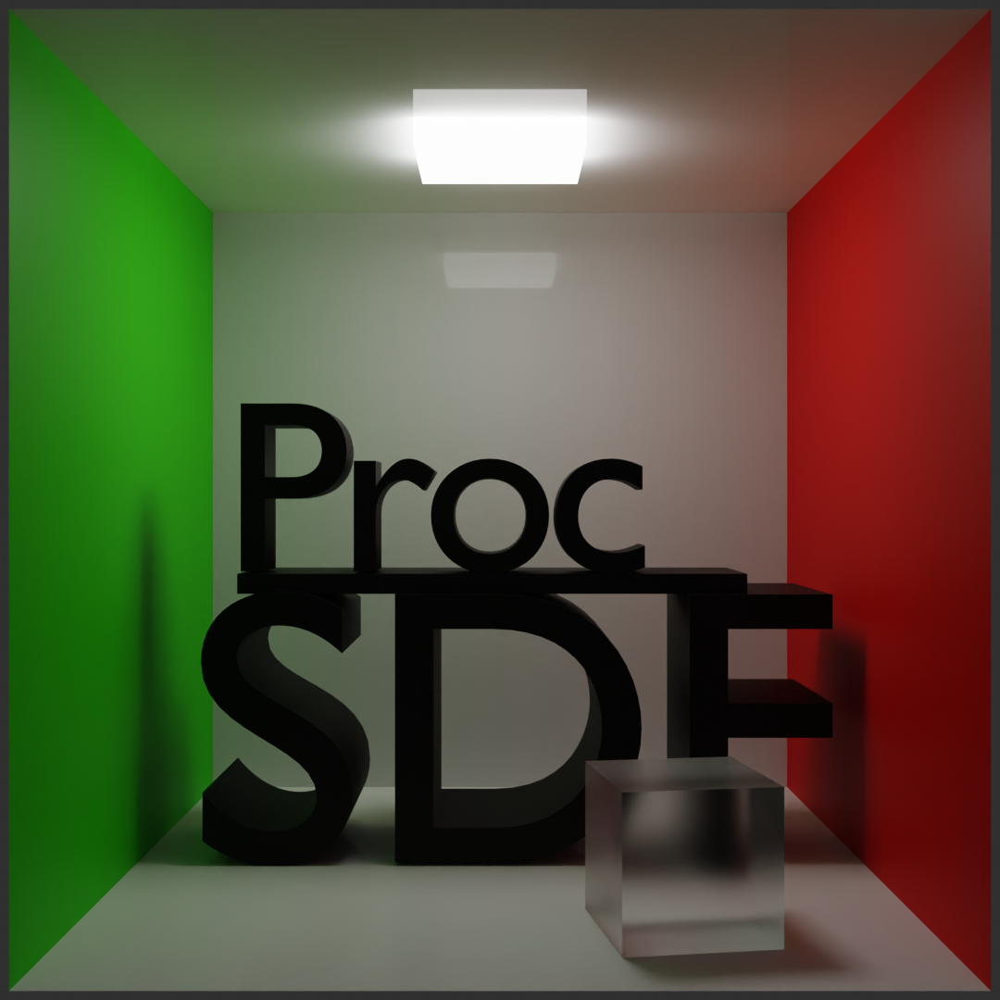

# ProcSDF

| Nope. This wasn't rendered in ProcSDF (yet :p) but in Blender. Hopefully we'll be able to render something like this in ProcSDF pretty soon. Godspeed, I guess.

---

# What is ProcSDF?

An **open-source**, **procedural**, **node-based**, **raymarched** 3D creation tool.

- It's open-source. Though this has started as a final year BTP project as a part of our CSE coursework, we plan on making it a community-driven project once the BTP is done with.

- It's procedural and node-based. Everything happens through nodes. The node workspace is your playground; add primitives, translate them, rotate them, perform operations and set up materials (TODO : materials :p) - all in the workspace.

- It's raymarched. Think raytracing, but more fun. Check out [this very fun blog](https://michaelwalczyk.com/blog-ray-marching.html) to know more about raymarching. Other than that [Inigo Quilez](https://iquilezles.org/)'s resources on raymarching are always a godsend. 

# How to run ProcSDF?

The [latest release](https://github.com/angad-k/ProcSDF/releases/latest) on GitHub would be the easiest way to run ProcSDF. The zip file has the executable and some other useful files to get you started.

# Tell me more about ProcSDF

- The GUI's made in the friendly neighbourhood GUI library - **ImGUI**. Check it out [here](https://github.com/ocornut/imgui).

- The pipeline and rendering stuff is handled in **OpenGL**.

- Features :
    - Primitives, Operations on them, translations, scaling and rotations.
    - Adding your own custom SDFs
    - Materials (you can also add your own custom materials!)

- The name doesn't have much thought to it. Though it does have a nice ring to it. We were working on making a procedural node based 3D edition software that uses SDFs and so, comes the name **ProcSDF**

### Check out [this document](https://github.com/user-attachments/files/16238330/ProcSDF.pdf) to read up on ProcSDF in more detail. We made it as a our final report for the university project but works well in introducing the reader to everything there is to be known about ProcSDF - from implementation to usage.
